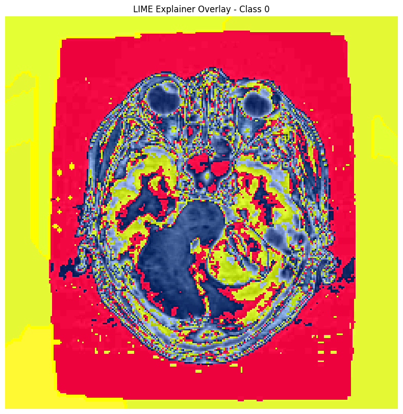
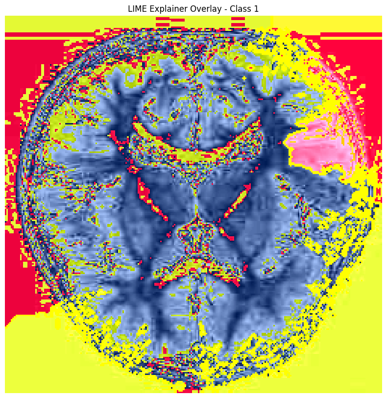
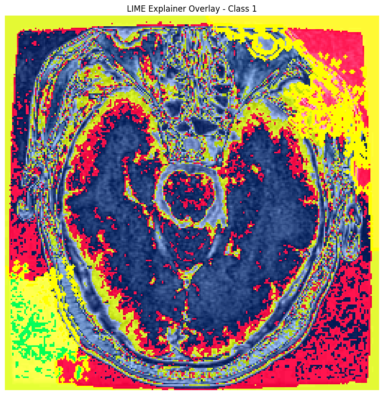

# Brain Tumor Diagnostic Pipeline: Multi-Modal XAI Report

This report fuses Spatial (LIME), Statistical (SHAP), and Symbolic (Logic) explainability.

## Case: Tumor correctly detected
**Result:** Tumor (Confidence: 73.1%)

### Clinical Reasoning
> Model predicts Tumor (confidence 73%). However, no symbolic rules triggered: No prominent tumor-associated patterns detected. Manual radiologist review is recommended to verify this prediction.

* **Triggered Rules:** None
---

## Case: Healthy correctly detected
**Result:** Healthy (Confidence: 8.5%)

### Clinical Reasoning
> Model predicts Healthy (confidence 8%). However, no symbolic rules triggered: No prominent tumor-associated patterns detected. Manual radiologist review is recommended to verify this prediction.

* **Triggered Rules:** None
---

## Case: Missed Tumor
**Result:** Healthy (Confidence: 14.2%)

### Clinical Reasoning
> Model predicts Healthy (confidence 14%). Rule R6 triggered: peripheral mass indicator present in CNN feature 10 — consistent with tumour-associated spatial patterns.

* **Triggered Rules:** R6
---

